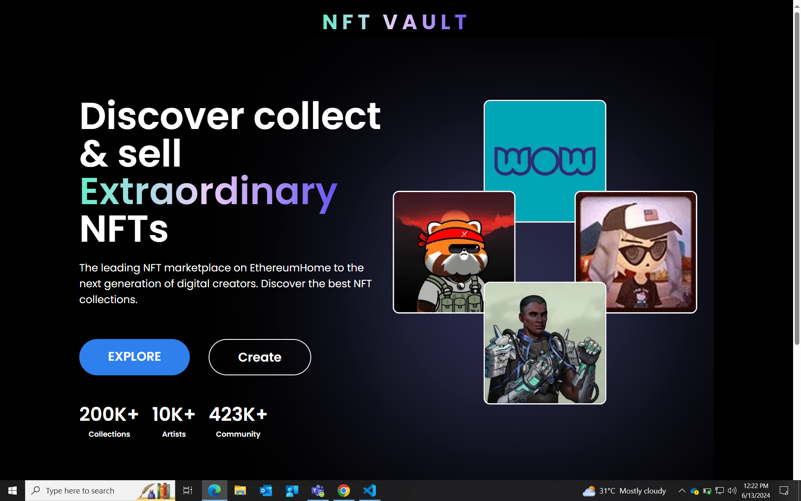

Let's break our app into components

Components:
    Header
    Hero section
    Brand section
    Trending NFT section
    Info section
    Footer

Folder structure:
    src/Components
        <component> subfolder 
            index.js
            <component>.css

Google fonts
    Poppins
        @import url('https://fonts.googleapis.com/css2?family=Poppins:wght@400;500;600;700&display=swap');

App.js
    Render all components

CSS common classes for reusability
    src/common/styles
        commonClasses.css
        variables.css

Header
    title
    common styles for headings

TopFold section
    2 part : left & right

Brand integration section
    static image

Trending NFT section
    slider - npm pkg 'react-slick'
    define settings
    style slider

Trending info section

Footer